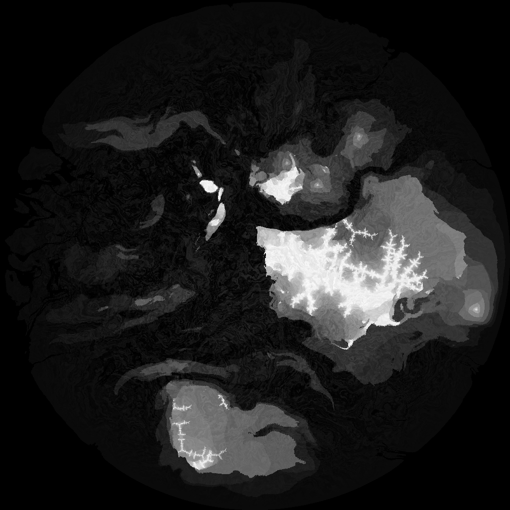

# IslandGenerator

A Python mountainous island heightmap generator, using domain warped fractaled simplex noise and the Julia Set. Yep, that's a lot of adjectives.

I tried to keep everything meaningful in a single file, because it's (maybe) simpler.
There's only the vector class in another file, but it's not mine, so it's ok.

To launch the code, simply `python main.py`

Here's what it looks like :

Latest image : 

These are with 2 warpings :

## Dependencies

The list of dependencies is written in `requirements.txt`.
There's one more dependency that you need for noise, stored in the zip archive (stop screaming please, it's my git I do what I want).
This noise library is not my own, you can find its author [here](https://github.com/caseman/noise).
To install it, just extract it and use `python setup.py install`.
Also, I use a Vector class, for vector arithmetics.
I'm not the author of this class, you can find the original code [there](https://gist.github.com/mcleonard/5351452).

## Inspirations

This generator makes use of both the Julia set and some domain warped fractaled simplex noise.
My goal was to create some mountainous heightmaps to look just like the Alps in Switzerland.
They're all fractally looking (go check in GMaps), hence the use of the Julia set.
I thought by "mixing up" the Julia set and the Simplex noise I could get something looking like the Alps.
Now to define what this "mix up" should be :)

### The Julia set

The Julia set in mathematics is a... Why am I even trying ? Go look it up [there](https://en.wikipedia.org/wiki/Julia_set), it's beautiful.
Also, the Julia calculation code is not completely my own, it's been partially taken from this [place](http://code.activestate.com/recipes/577120-julia-fractals/).

### Domain warped fractaled Simplex noise

Simplex noise is a simpler, faster to compute Perlin noise. But what is Perlin noise ? Google it (or [click here](https://en.wikipedia.org/wiki/Perlin_noise)).
A "fractaled" Simplex noise is just some layers (called octaves) of simplex noise rescaled and added to each other.
As for domain warping, go check this [great article](http://www.iquilezles.org/www/articles/warp/warp.htm) by the even greater Inigo Quilez.

## How does this work

I don't know, I'm a programmer, it works and I'm happy, that's it !

Ok I do know.
If you read the article on the Julia set, or the code, you know that the principle of creating the fractal is to add some complex value to a given complex value in the gaussian plane again and again until either a maximum value of iterations is reached or the given value exceeds a certain number, usually 2.
Well here it is : *usually*. The value for which to stop the Julia function iterating to death is defined by a function of the Simplex noise value at the given point.
Let's take an example : for `z = 0 + 1j`, instead of iterating over and over with a value `c` until `z` gets bigger than `2`, you do so until it gets bigger than the value of your noise at the point `(0, 1)`.

## What does this code outputs me and how am I to change it

This code outputs a 1024x1024 PNG image. It's a heightmap, so it's black and white.
The code is fully commented for you to understand (I hope) what does what.
Also, I tried to isolate the meaningful part so that you can easily play with it and change it accordingly to your needs.

Now the code can also output you the normal map and a gradient map, though the results are unreliable.
You better not use these maps "as is" since some colors might be missing, or be clamped depending of they're scaling.
Instead, use it as raw values in your code if you need it. 
Or correct the color output if you need the maps.

## So is it good code ?

No.
I suck at coding stuff.
But I like it, so it's my job now.

I tried to make the code as simple as possible and keep just what's needed, but I've had my nose in there for some weeks now and I'm too much stuck into the current format to be able to see it otherwise on my own.
If you think you can resolve some problems, make it simpler, more performant, efficient, scalable, whatever, PR the shit out of this repo. Or submit issues. Or both.
If you need some features, you can submit an issue, I'll try not to forget to look it up.

## What now ?

The heightmaps that the code outputs are just there for me to judge on the quality of the height calculation algorithm and I don't personnally plan on using these maps as is. The height values are 8 bits, so you only have 256 levels of height possible, which can be a quite low resolution depending on what you want to do with it.

If you were wanting to use these maps as is however, I would suggest two things : 
* dither it with some blue noise to mitigate the low height resolution.
* applying a blur on it.
Also, it can produce some plains at a high altitude, which is not quite how a mountain would behave. To solve this you'd need some post-process on the image to work on the gradient of the mountain maybe, or find a better configuration for the input values. Get creative and goos testing.

Knowing this, you can do your stuff with the code, fork it, put it in your own code, whatever you want.
Just don't kill people with it please.
Killing is not nice.

If you reuse this code, that would be nice to mention me somewhere with either :
 - My name and my contact : Alexandre Serex - serex.alexandre@gmail.com
 - My pseudonyme and my twitter : Minimata [@EpicMinimata](https://twitter.com/EpicMinimata)

Whatever suits your goat :)

Or don't.
Especially if you kill people with it.
You're all grown up.

## Troubleshooting

I don't know.
Maybe [that](https://www.google.com/) ?
